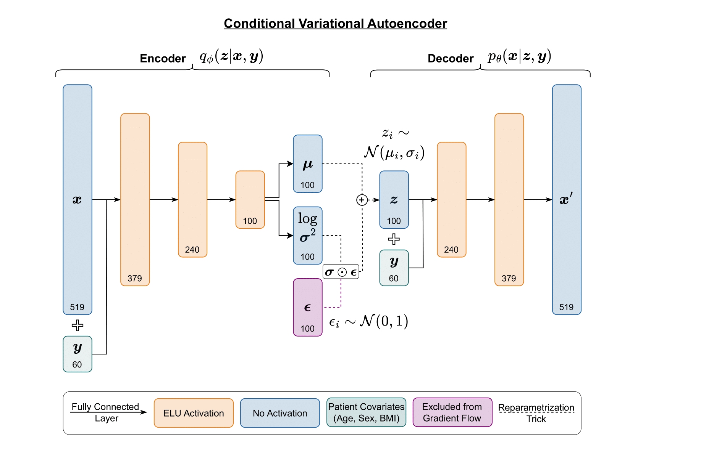
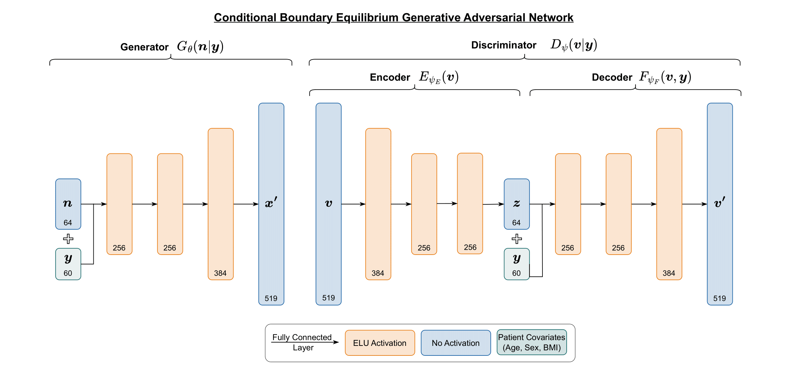

# Generative modeling of infrared molecular profiles opens pathways for controlled in-silico phenotyping studies

This repository provides the codebase accompanying the project *Generative Modeling of Infrared Molecular Profiles Opens Pathways for Controlled In-Silico Phenotyping Studies* by Süzeroglu, Halenke et al. While the original dataset used in the study is not publicly available, pretrained conditional models are included to enable the generation of realistic synthetic FTIR spectra conditioned on subject-specific attributes such as sex, age, and BMI.


Additionally, the repository is designed for flexible adaptation to other types of one-dimensional absorption spectral data and conditioning variables.

## Getting started
To get started, clone the repository, create a new virtual or conda environment, then install the requirements:

```
pip install -r requirements.txt
```

## Train your own models

To train your own generative conditioned variational autoencoder simply run:
```
python train.py --model cvae
```
or to train a conditioned boundary equilibrium GAN run:
```
python train.py --model cbegan
```
All configurations for the models can be made in the **configs.yaml** file. 

#### Models overview:

<div align="center">
  
  
</div>

#### Data preparation

The data path is set in the configs. Data can be provided in .csv, .xlsx or .parquet format.
Data should be organized in the following way:

| feature 1 | feature 2 | ... | feature n | condition 1 | ... | condition n |
|-----------|-----------|-----|-----------|-------------|-----|-------------|
| 0.1       | 0.2       | ... | 0.3       | male        | ... | 1.1         |
| 0.2       | 0.4       | ... | 0.1       | female      | ... | 0.8         |

Categorical and continuous condition columns must be set in the configs.
Data gets normalized and standardized in the preprocessing pipeline.

## Synthetic data generation
For an example how to generated data please check notebook **01-data_generation.ipynb** in the notebooks folder. After cloning the repository, run
```
git lfs pull
```

to download the pretrained models tracked by Git LFS.

#### Additional Data Information
The pretrained models were trained with the following conditional data distributions:


Data generation outside the distributions of the conditions in the training data set can lead to incorrect results (e.g., samples for patients < 35 years of age).        

## Collaborations

For collaboration please contact us via mail: niklas.leopoldkerschbaumer@cmf.hu or moritz.jung@cmf.hu

